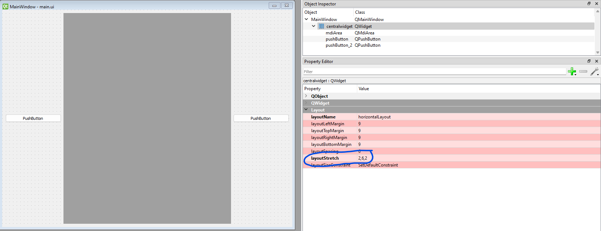

# ASTRA Khonsu

A graphical user interface to monitor the rover
## Translating the UI in code

### Installing pyuic5

- Identify where you have installed python (the folder where ypu have python.exe)
- Open a cmd in that folder *(NOTE: if it is on the C main drive open the terminal with administrator privileges)* and execute: 

        python -m pip install PyQt5

After you have successfully installed PyQt5 you should be able to execute inside a terminal the command

    pyuic5

The command:

    pyuic5 /path/to/your/.ui_file -o generated_code.py

will generate the `generated_code.py` file inside the folder where you execute the command

### Organization of the project
 - The `res` folder contains the resources used by the interface(images,etc..)
 - The `ui` folder will contain the .ui file obtained with QT Designer

## Embedding windows

A useful resource: https://stackoverflow.com/questions/71027763/how-to-open-a-new-mdi-sub-window-in-pyqt5

Secondary windows can be modeled in QT Designer as 'Widgets' *(NOTE: requires a little change in the code, see section 'Adapting widget code' below)*. In the `example_widget` folder there are:
-  `example_widget.py` file which describe a secondary window 
-   `main.py` file where there's the code of the main window that embed `example_widget.py` secondary window

### Adapting Widget object code

Substitute the following lines:

    class Ui_Form(object):
        def setupUi(self, Form):
            Form.setObjectName("Form")
            Form.resize(400, 300)

with these ones `(of course for the class name and variable names you can put whatever name you want bu you must keep consistency with the rest of the code)`:

    class ExampleWidget(QtWidgets.QWidget):
        def __init__(self):
            super().__init__()
            Form = self
            Form.setObjectName("Form")
            Form.resize(400, 300)

## Layout weights

To specify weights for space of elements inside a container you have to search the parent layout and set the `layoutStretch` property as you want. See the example:

</img>

where I specified `2,6,2` to get the 20% 60% 20% proportions of the 3 elements