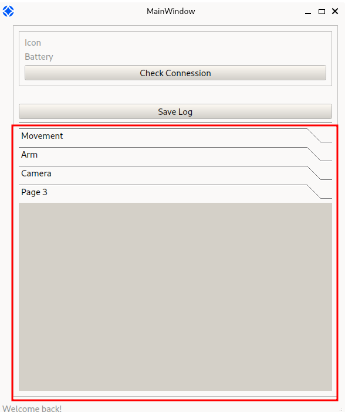

# ASTRA Khonsu

A graphical user interface to monitor our rover "Scout". Currently migrating from PyQt5 to PySide6.

**Work in progress**

- [ ] Assicurarsi che la connessione sia stata correttamente stabilita. Attualmente lancia eccezione.
- [ ] Gestire comportamento quando chiudi la GUI durante un'operazione send-astruino
- [ ] Ricevere output da arduino e stamparlo su terminale in app
- [ ] Trova widget migliore per il log. Serve che abbia degli eventi "valueChanged" così da potere abilitare e disabilitare il tasto.
- [ ] Sistemare grandezza stream
- [ ] GUI [Commands to implement](https://www.notion.so/astra-team/Documentazione-comandi-e445912294c94576b910cc75a6e5b087)
- [ ] Implementare file `.env`
- [ ] Implement [`requirements.txt`](https://www.google.com/search?client=firefox-b-d&q=what+is+a+requirement+file+python)


# Installation

TODO

# Development

Clone the repo with

    git clone https://github.com/astra-mt/scout.git

and change the directory with

    cd khonsu

all the files you need for development will be here! Open VSCode or any other IDE of your choice there.

TODO add `requirements` and run them


Running the app from `khonsu` will result in an error. Instead, cd into the previous folder `cd ..`, and run it with `python -m khonsu.main`

TODO Fix that

## How to create a Widget with QtCreator
TODO

## How to generate a widget starting from a .ui file

Pre requisites:
    
    pip install pyuic5-tool
    pip install pyside6

### Example assuming "Movement" as widget name
We are going to create a Widget called "Movement", and place it inside the `.ui` folder

The command:

    pyuic5 --output=./ui/movement.py ./ui/movement.ui

will generate the `movement.py` file inside the folder where you executed the command.
The resulting file uses PyQt5 (but we're currently using PySide6!)

Open the newly generated file, and replace the following lines:

``` python

    from PyQt5 import ... 

    ...

    class Ui_Form(object):
        def setupUi(self, Form):
            Form.setObjectName("Form")
            Form.resize(400, 300)
```

with these ones

``` python

    from PySide6 import ... 

    ...

    class MovementWidget(QtWidgets.QWidget):
        def __init__(self):
            super().__init__()
            Form = self
            Form.setObjectName("MovementWidget")
            Form.setAccessibleName("MovementWidget")
```
adapting your widget name as needed.

Nomenclature: `movement.ui`, `movement,py`, `MovementView(QtWidgets.QWidget)`, `MovementWidget()`

##  Add new Widget in the Toolbox
We are going to add the widget `Movement` we previously generated and show it in the toolbox (the red square) after you generated a file



The toolbox accepts widgets as children. An empty template, called `page_3`, can be found somewhere in the `main.py` file, inside the `ui_init()` function.

Import the class in the Movement Widget in the main file

    from .ui.movement import MovementView

Copy and paste the following lines
``` python
    def __init__(self):
    ...
    self.page_3 = QtWidgets.QWidget()
    self.page_3.setObjectName("page_3")
    self.toolBox.addItem(self.page_3, "")

    ...
    def retranslateUi(self):
        self.toolBox.setItemText(self.toolBox.indexOf(
        self.page_3), _translate("MainWindow", "Page 3"))
```

and turn them into these
``` python
    def __init__(self):
    ...
    self.movementWidget = QtWidgets.QWidget()
    self.movementWidget.setObjectName("movementWidget")
    self.toolBox.addItem(self.movementWidget, "")

    ...
    def retranslateUi(self):
        self.toolBox.setItemText(self.toolBox.indexOf(
        self.movementWidget), _translate("MainWindow", "Movement"))
```
Common error: never touch "MainWindow"

If you run the application everything should run!

## Widget Signals and function handling

This is what we use to set data in the GUI

We are going to change spinbox value (the number selector under the dial), according to the dial position.

First, write this inside the `MovementWidget` class

``` python
    self.dial.valueChanged.connect(
        lambda: self.handle_valueChanged_dial()
    )
```

This has to be read like this: whenever the dial changes its value, execute the method `handle_valueChanged_dial`, which is:


``` python
    def handle_valueChanged_dial():
        self.spinBox_rpm.setValue(self.dial.value())
```
which can be read as: whenever this method is invoked, change the spinbox counter to the current dial value

## Camera

At the moment, the camera is highly problematic. To stop running the camera simply comment out these lines in the main

``` python

    if __name__ == "__main__":
        ...
        ui.setup_camera()
        ui.timer.stop()
        ...
```

## Project Folders
 - The `res` folder contains the resources used by the interface (images, etc.)
 - The `ui` folder will contain the .ui file obtained with QT Designer

## Debugging

Open the file `bluetooth.ino` within the Arduino IDE, then load it on the board and run it. Open the serial plotter to see the received data, and choose the option `Both NL & CR`.

A list of commands can be acquired by sending the command `AT+HELP`. Some of those instructions don't work. That command and others can be found in the [Notion AT-09 Documentation](https://www.notion.so/astra-team/Documentation-of-bluetooth-module-AT-09-4bb4d29fb7db46d291fcfd81fea8ce22) that contains all the tested commands we've been able to send.

Make sure to select the board *Arduino Mega or Mega 2560*, in the dropdown menu in the top left border.   